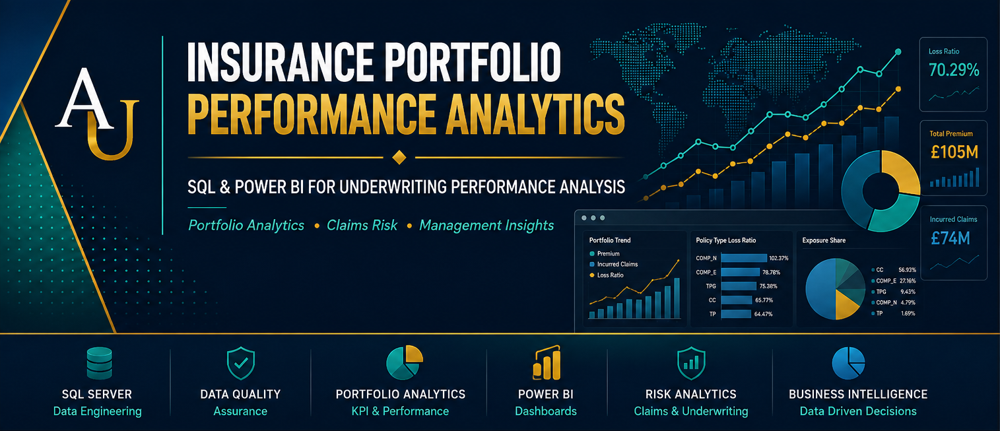
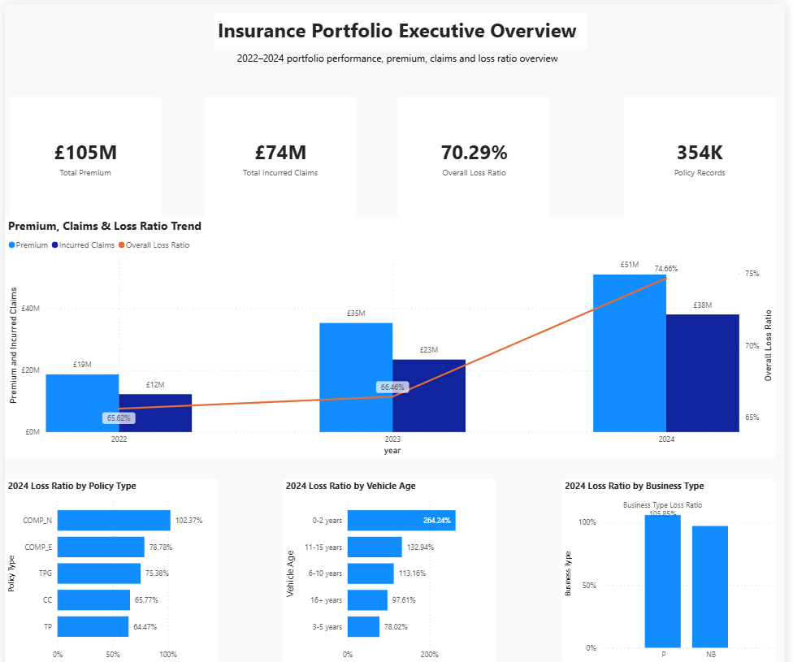
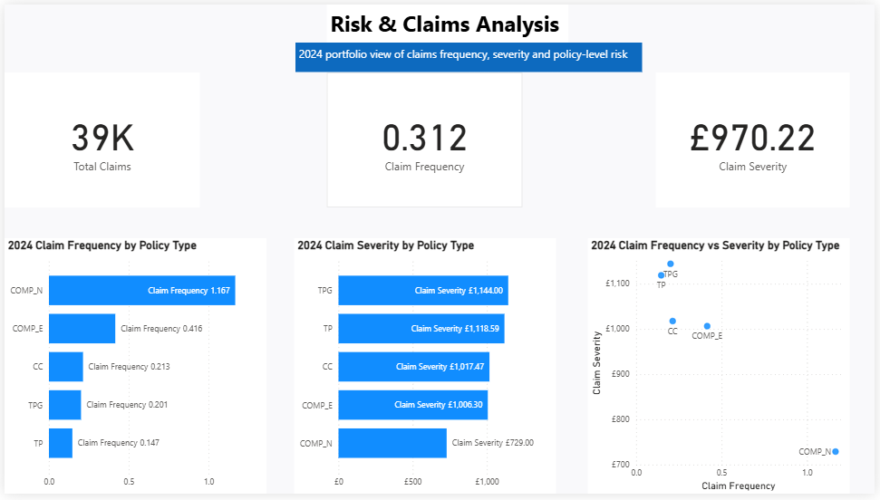
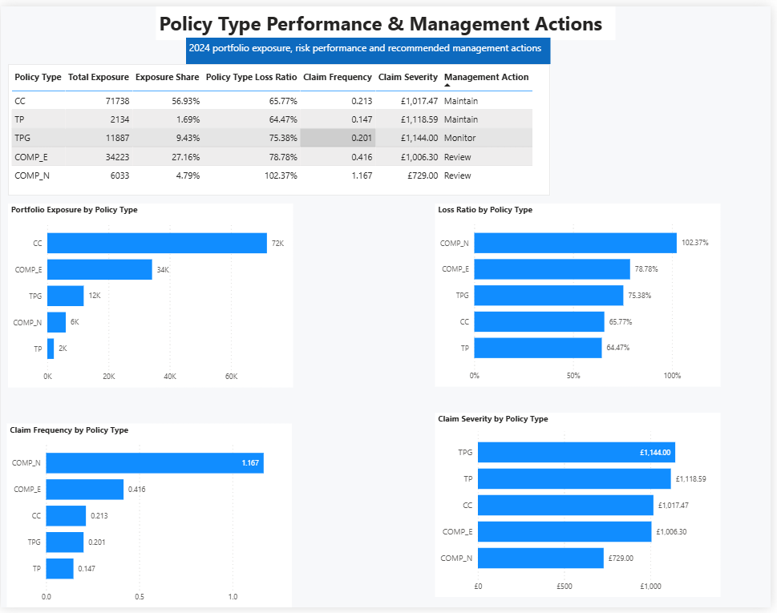

# Insurance Portfolio Analytics

> **End-to-End Insurance Portfolio Performance, Risk & Management Analytics using SQL Server and Power BI**

An insurance analytics project designed to evaluate portfolio profitability, claims performance, exposure concentration and underwriting risk, and translate the findings into actionable management decisions.

---

## Table of Contents

- [Executive Summary](#executive-summary)
- [Business Problem](#business-problem)
- [Project Objectives](#project-objectives)
- [Analytical Workflow](#analytical-workflow)
- [Core Insurance Metrics](#core-insurance-metrics)
- [Key Results](#key-results)
- [2024 Policy-Type Analysis](#2024-policy-type-analysis)
- [Business & Actuarial Insights](#business--actuarial-insights)
- [Business Impact & Recommendations](#business-impact--recommendations)
- [Power BI Dashboard Showcase](#power-bi-dashboard-showcase)
- [Assumptions](#assumptions)
- [Limitations](#limitations)
- [Technologies Used](#technologies-used)
- [Skills Demonstrated](#skills-demonstrated)
- [Repository Structure](#repository-structure)
- [How to Reproduce the Analysis](#how-to-reproduce-the-analysis)
- [Future Enhancements](#future-enhancements)
- [Conclusion](#conclusion)
- [Author](#author)
- [License](#license)

---

## Executive Summary

This project provides an end-to-end analysis of an insurance portfolio using **SQL Server and Power BI**.

The analysis examines portfolio performance across **2022–2024**, focusing on premium, incurred claims, loss ratio, exposure, claim frequency and claim severity. It also investigates performance across policy types, vehicle-age segments and business types to identify areas of elevated underwriting risk.

The final Power BI solution converts these measures into three decision-focused dashboards covering:

- Executive portfolio performance
- Risk and claims analysis
- Policy-type performance and management actions

The portfolio generated approximately **£105M in premium** and **£74M in incurred claims**, producing an overall loss ratio of approximately **70.29%**. The analysis also identifies material differences in performance between portfolio segments, allowing management attention to be directed toward higher-risk areas.

---

## Business Problem

Insurance portfolios can generate substantial premium while still containing segments that weaken overall underwriting performance.

Management therefore needs more than a high-level view of premium and claims. It needs to understand:

- Which segments generate the greatest exposure?
- Where are loss ratios becoming unfavourable?
- Are poor results being driven by claim frequency, claim severity, or both?
- Which policy types require management intervention?
- How is portfolio performance changing over time?

This project addresses these questions by transforming raw insurance portfolio data into structured analytical views and management-focused Power BI dashboards.

---

## Business Questions

The analysis was designed to answer the following questions:

1. How has portfolio premium, incurred claims and loss ratio changed between 2022 and 2024?
2. Which policy types account for the largest share of portfolio exposure?
3. Which policy types have the highest loss ratios?
4. Which segments exhibit elevated claim frequency?
5. Which policy types generate the highest average claim severity?
6. How does vehicle age influence loss-ratio performance?
7. Are there material differences in performance across business types?
8. Which portfolio segments should management maintain, monitor or review?

---

## Project Objectives

The objectives of the project were to:

- Build a reliable analytical dataset from raw insurance portfolio data.
- Perform structured data-quality checks before analysis.
- Create reusable SQL analytics views.
- Measure portfolio premium, claims, exposure and underwriting performance.
- Analyse claim frequency and severity.
- Identify higher-risk portfolio segments.
- Develop management-action logic based on portfolio performance.
- Build interactive Power BI dashboards for executive and analytical reporting.
- Translate technical results into clear business recommendations.

---

## Dataset Overview

The project uses insurance portfolio records covering **2022–2024**.

The analytical dataset contains information relating to:

- Policy year
- Policy type
- Business type
- Vehicle age
- Exposure
- Premium
- Claims
- Incurred claims

These variables support the calculation of portfolio-level and segment-level underwriting metrics.

---

## Data Quality Assessment

Before analytical modelling, the dataset was subjected to structured SQL data-quality checks.

The assessment considered areas such as:

- Missing values
- Duplicate records
- Invalid or inconsistent values
- Numerical field validity
- Categorical consistency
- Exposure and premium integrity
- Claims-related fields
- Data suitability for downstream analysis

This stage was completed before the creation of the final analytics views to reduce the risk of reporting unreliable portfolio metrics.

---

## Data Dictionary

| Field | Description |
|---|---|
| `year` | Portfolio/reporting year |
| `policy_type` | Insurance policy category |
| `business_type` | Business classification |
| `vehicle_age_band` | Vehicle-age grouping |
| `policy_records` | Number of policy records |
| `total_exposure` | Aggregate insurance exposure |
| `total_premium` | Total premium generated |
| `total_claims` | Number of claims |
| `total_incurred` | Aggregate incurred claim cost |
| `premium_per_exposure` | Premium relative to exposure |
| `claim_frequency` | Claims relative to exposure |
| `claim_severity` | Average cost per claim |
| `loss_ratio_pct` | Incurred claims relative to premium |
| `exposure_share` | Segment share of portfolio exposure |

---

## Methodology

The project followed a structured insurance analytics workflow.

### 1. Database Setup & Raw Data Import

The source data was imported into **SQL Server** and organised within the project database.

### 2. Data Quality Audit

SQL queries were used to assess data completeness, consistency and analytical suitability.

### 3. Staging & Data Cleaning

A staging layer was used to prepare and standardise the data before analytical calculations were performed.

### 4. Exploratory Analysis

Initial SQL analysis was conducted to understand:

- Portfolio composition
- Premium distribution
- Claims behaviour
- Exposure concentration
- Segment-level performance

### 5. Analytics Views

Reusable SQL views were created to provide aggregated portfolio metrics for Power BI reporting.

These views support analysis by dimensions including:

- Policy type
- Vehicle age
- Business type
- Year

### 6. Power BI Modelling

The SQL analytical layer was connected to Power BI, where measures and reporting logic were developed for portfolio monitoring and decision support.

### 7. Management Action Logic

Portfolio segments were classified into management-action categories using a combination of loss-ratio and exposure performance.

The resulting categories include:

- **Maintain**
- **Grow**
- **Monitor**
- **Review**

This converts analytical results into an interpretable management framework.

---

## Analytical Workflow

Raw Insurance Data
        ↓
SQL Server Database
        ↓
Data Quality Audit
        ↓
Staging & Cleaning
        ↓
Exploratory Analysis
        ↓
Analytics Views
        ↓
Portfolio KPIs
        ↓
Power BI Data Model
        ↓
Risk & Performance Analysis
        ↓
Management Action Logic
        ↓
Executive Dashboards
        ↓
Business Recommendations

---

## Core Insurance Metrics

### Loss Ratio

The loss ratio measures incurred claims relative to premium:

**Loss Ratio = Total Incurred Claims / Total Premium**

It provides a key indication of underwriting performance.

### Claim Frequency

Claim frequency measures the number of claims relative to portfolio exposure:

**Claim Frequency = Total Claims / Total Exposure**

### Claim Severity

Claim severity measures the average cost associated with each claim:

**Claim Severity = Total Incurred Claims / Total Claims**

### Exposure Share

Exposure share measures the proportion of total portfolio exposure represented by a particular segment.

Together, these metrics provide a more complete assessment of portfolio risk than analysing claims or premium independently.

---

## Key Results

The executive analysis produced the following headline portfolio indicators:

| KPI | Result |
|---|---:|
| Total Premium | **£105M** |
| Total Incurred Claims | **£74M** |
| Overall Loss Ratio | **70.29%** |
| Policy Records | **354K** |

Portfolio premium increased substantially across the analysis period, but incurred claims and loss ratio also increased.

The annual loss ratio moved from approximately:

- **65.62% in 2022**
- **66.46% in 2023**
- **74.66% in 2024**

This indicates deterioration in underwriting performance despite portfolio growth.

---

## 2024 Policy-Type Analysis

The 2024 policy-type analysis highlighted significant differences between portfolio segments.

| Policy Type | Exposure Share | Loss Ratio | Claim Frequency | Claim Severity | Management Action |
|---|---:|---:|---:|---:|---|
| CC | 56.93% | 65.77% | 0.213 | £1,017.47 | Maintain |
| TP | 1.69% | 64.47% | 0.147 | £1,118.59 | Maintain |
| TPG | 9.43% | 75.38% | 0.201 | £1,144.00 | Monitor |
| COMP_E | 27.16% | 78.78% | 0.416 | £1,006.30 | Review |
| COMP_N | 4.79% | 102.37% | 1.167 | £729.00 | Review |

---

## Business & Actuarial Insights

### 1. Portfolio growth is accompanied by increasing underwriting pressure

Premium increased from approximately **£19M in 2022** to approximately **£51M in 2024**.

However, incurred claims increased alongside this growth, while the portfolio loss ratio rose to approximately **74.66% in 2024**.

This suggests that growth should be evaluated alongside profitability rather than premium volume alone.

### 2. COMP_N represents the clearest loss-ratio concern

COMP_N recorded a **102.37% loss ratio**, meaning incurred claims exceeded premium for the segment before considering operating expenses and other costs.

It also recorded the highest claim frequency at approximately **1.167**.

This combination makes the segment a priority for management review.

### 3. COMP_E is strategically important because of its portfolio size

COMP_E represents approximately **27.16% of portfolio exposure** and recorded a loss ratio of approximately **78.78%**.

Because of its relatively large exposure share, deterioration within this segment could materially affect overall portfolio results.

### 4. CC represents the largest exposure concentration

CC accounts for approximately **56.93% of portfolio exposure** while maintaining a loss ratio of approximately **65.77%**.

Its scale means that even relatively small changes in performance could have a significant effect on the overall portfolio.

### 5. Frequency and severity reveal different risk characteristics

TPG records the highest claim severity at approximately **£1,144**, whereas COMP_N exhibits the highest claim frequency.

This demonstrates why loss ratio should be decomposed into frequency and severity when assessing portfolio risk.

---

## Business Impact & Recommendations

Based on the analysis, management could consider the following actions:

### COMP_N — Review
Investigate pricing adequacy, underwriting criteria, claims behaviour and risk selection. The combination of a loss ratio above 100% and very high claim frequency warrants attention.

### COMP_E — Review
Review pricing and underwriting performance because the segment combines a relatively high loss ratio with substantial portfolio exposure.

### TPG — Monitor
Continue monitoring severity and overall loss-ratio development, particularly because claim severity is comparatively high.

### CC — Maintain
Maintain the segment while monitoring trends closely because it represents the largest concentration of portfolio exposure.

### TP — Maintain
Current indicators are comparatively favourable, although ongoing monitoring remains appropriate.

The broader management implication is that portfolio growth should be assessed alongside **risk-adjusted profitability**, rather than premium growth in isolation.

---

## Power BI Dashboard Showcase

The Power BI solution consists of three interconnected dashboard pages designed to move from executive portfolio monitoring to detailed claims analysis and management action.

### 1. Insurance Portfolio Executive Overview

Provides a high-level view of portfolio growth, underwriting performance and risk trends across 2022–2024.



**Key decision areas:** Premium growth • Claims development • Loss ratio trends • Policy-type performance • Vehicle-age risk • Business-type performance

---

### 2. Risk & Claims Analysis

Examines the underlying claims drivers through frequency, severity and policy-level risk segmentation.



**Key decision areas:** Claim frequency • Claim severity • Policy-type risk • Frequency–severity interaction

---

### 3. Policy Type Performance & Management Actions

Translates portfolio performance into segment-level management actions by combining exposure, loss ratio, claim frequency and claim severity.



**Key decision areas:** Exposure concentration • Underwriting performance • Risk prioritisation • Maintain / Monitor / Review actions

---

## Assumptions

The analysis assumes that:

- Source premium, exposure and claims information is representative of the portfolio being analysed.
- Incurred claims are appropriate for the loss-ratio calculations performed.
- Exposure is consistently defined across portfolio segments.
- Policy and business classifications are sufficiently consistent for comparative analysis.
- The available historical period provides a useful basis for portfolio monitoring.

---

## Limitations

This project is designed as a portfolio analytics and decision-support solution rather than a complete insurance pricing model.

Limitations include:

- The available analysis covers a limited historical period.
- Results are based on aggregated portfolio characteristics.
- No explicit allowance has been made for claims development uncertainty.
- External economic and inflationary factors have not been separately modelled.
- Management-action categories provide analytical guidance and should not replace full underwriting investigation.
- More granular risk factors could improve segmentation and pricing analysis.

---

## Technologies Used

| Technology | Application |
|---|---|
| **SQL Server** | Database management and analytical processing |
| **T-SQL** | Data quality, cleaning, transformation and analytical views |
| **Power BI** | Data modelling, DAX measures and dashboard development |
| **DAX** | Portfolio KPIs and management-action logic |
| **GitHub** | Version control, documentation and portfolio presentation |

---

## Skills Demonstrated

This project demonstrates practical capability in:

- Insurance portfolio analytics
- Underwriting performance analysis
- Loss-ratio analysis
- Claim frequency and severity analysis
- Exposure analysis
- SQL data preparation
- Data-quality assessment
- SQL analytical views
- Power BI development
- DAX measures
- KPI design
- Risk segmentation
- Management reporting
- Business interpretation
- Data storytelling

---

## Repository Structure

```text
Insurance-Portfolio-Analytics/
│
├── data/
│   └── Project data
│
├── images/
│   └── Final Power BI dashboard screenshots
│
├── powerbi/
│   └── Power BI dashboard file
│
├── reports/
│   └── Insurance portfolio analytics report
│
├── sql/
│   ├── 01_database_setup_and_raw_import.sql
│   ├── 02_data_quality_audit.sql
│   ├── 03_staging_cleaning.sql
│   ├── 04_exploratory_analysis.sql
│   └── 05_analytics_views.sql
│
└── README.md
```

---

## How to Reproduce the Analysis

1. Clone or download the repository.
2. Review the source data contained in the `data` directory.
3. Open SQL Server Management Studio.
4. Execute the SQL scripts sequentially from `01` through `05`.
5. Confirm that the required analytical views have been created.
6. Open the Power BI file contained in the `powerbi` directory.
7. Update the SQL Server connection if required.
8. Refresh the Power BI model.
9. Review the three dashboard pages and portfolio measures.

---

## Future Enhancements

Potential extensions to the project include:

- More granular underwriting segmentation
- Geographic risk analysis
- Claims-development analysis
- Inflation-adjusted claim severity
- Predictive claim-frequency modelling
- Predictive claim-severity modelling
- Technical pricing models
- Profitability analysis at policy level
- Automated portfolio monitoring
- Scenario and sensitivity analysis
- Integration with reserving and pricing workflows

---

## Conclusion

This project demonstrates how insurance portfolio data can be transformed into a structured management decision-support solution.

By combining **SQL-based data preparation and analytical views with Power BI reporting**, the project moves beyond descriptive reporting to identify portfolio growth, underwriting deterioration, exposure concentration and claims-risk drivers.

Most importantly, the analysis translates portfolio metrics into practical management actions, demonstrating how actuarial and business analytics can support better insurance decisions.

---

## Author

### Anthony Utulu

**Actuarial & Business Analytics Professional**

*Transforming Data into Better Decisions*

📧 Email: [utulu.an@gmail.com](mailto:utulu.an@gmail.com)

💼 LinkedIn: [linkedin.com/in/utulu-an](https://www.linkedin.com/in/utulu-an)

💻 GitHub: [github.com/Utulu1](https://github.com/Utulu1)

If you found this project useful or would like to discuss actuarial modelling, insurance analytics or business analytics, feel free to connect with me on LinkedIn.

---

## License

This project is licensed under the **MIT License**.

---
